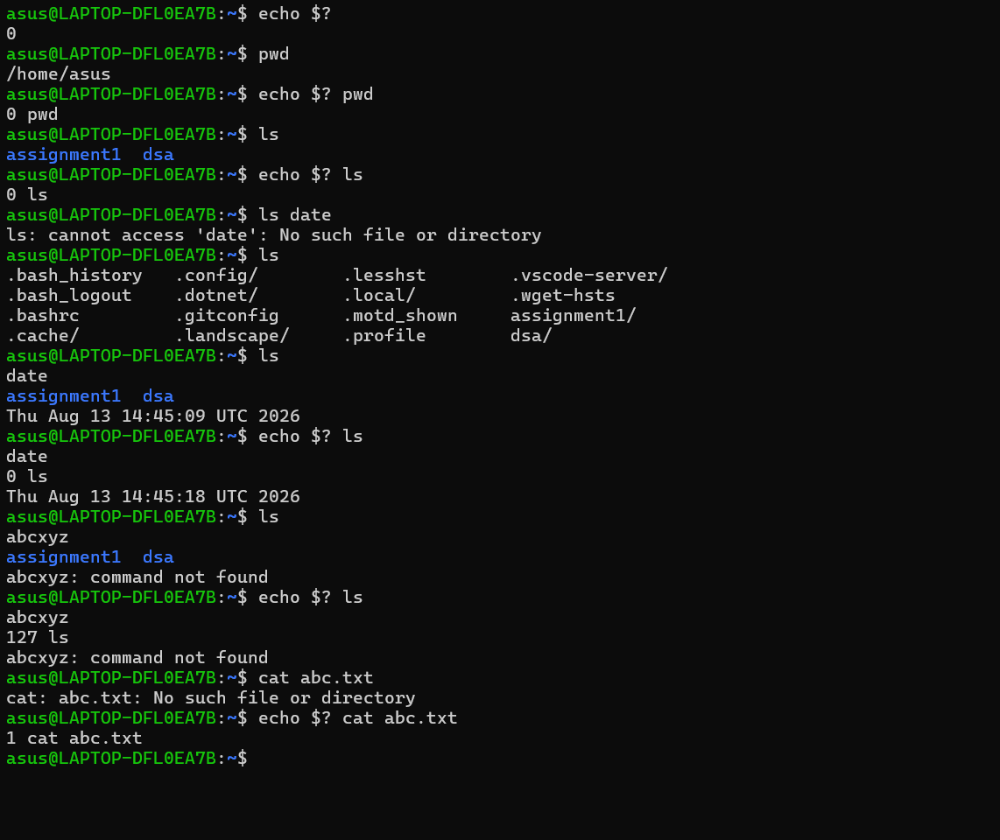

1. What If There Were No Operating System?

\->

An operating system is the main software that helps the user communicate with the computer hardware. If there was no OS, using a computer would be very difficult. We cannot easily open files, install applications, use devices or manage programs.

Without OS vs With OS

| **Without OS**|**With OS**|
|-|-|
|Difficult to use hardware|OS helps to use hardware easily|
|File management is difficult|Files can be created and managed easily|
|Programs are difficult to run|Programs can be opened and closed easily|
|No proper user interface|GUI or terminal is available|
|Security and permissions are difficult|Users and file permissions can be managed|

Three Linux Features

1\. File Management:

Linux allows us to create and manage files using commands.

**mkdir linux\_lab**

**cd linux\_lab**

**touch file1.txt**

**ls -l**

2\. Reading Files using cat:

Linux allows us to read the content of a file using the cat command.

**cat file1.txt**

This displays the content of the file.

3\. Viewing Parts of a File:

Linux also provides head and tail commands.

**head file1.log**

It shows the first 10 lines of the file.

**tail file1.log**

It shows the last 10 lines of the file.

2\. Imagine your team is setting up a cybersecurity laboratory. Explore at least five Linux distributions relevant to cybersecurity and recommend suitable distributions for different roles such as penetration testing, digital forensics, privacy, and security monitoring. Present your findings creatively as a comparison chart, poster, infographic, or “OS selection guide.” 

\->

five Linux distributions relevant to cybersecurity

|**Linux**|**Used For**|
|-|-|
|Kali Linux|Penetration testing|
|CAINE|digital forensics|
|Tails|privacy|
|Security Onion|security monitoring|
|Parrot OS|Security testing|

3\. Exit status: 

Execute at least five Linux commands that produce both successful and unsuccessful results. Investigate their exit status using `$?`.

Create a simple visual/table showing \*Command → Result Exit Status → Meaning\*.

What can a script learn from an exit status? 

\->

Exit status number given by Linux after running the command and it tells us wheather the command work or not.

**echo $?** : if output is 0 means worked successful and non-zero are mean that failed.

|**Command**|**Result**|**Exit Status**|**Meaning**|
|-|-|-|-|
|pwd|Success|0|Shows the current folder|
|ls|Success|0|Shows files and folders|
|ls  date|Success|0|show D,M,D with time|
|ls abcxyz|Failed|2|No such file or directory|
|cat abc.txt|Failed|1/2|No such file or directory|

A script can check the exit status to know if a command was successful or not.

0 = Success

Non-zero = Error

---

